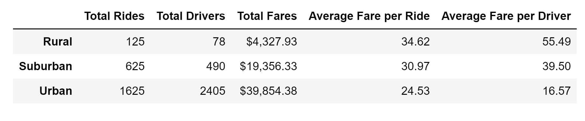

# PyBer_Analysis
Starting at PyBer

###### Source:https://gfycat.com/cavernousleafyjuliabutterfly

### Overview of the analysis:
The purpose of this Module is to create a summary DataFrame of the ride-sharing data by city type. We understood the metrics of the Pyber ride. Also, using the Pandas and Matplotlib libraries, we create the visualization. This report will include multiple-line graphs.

### Results

### Summary
